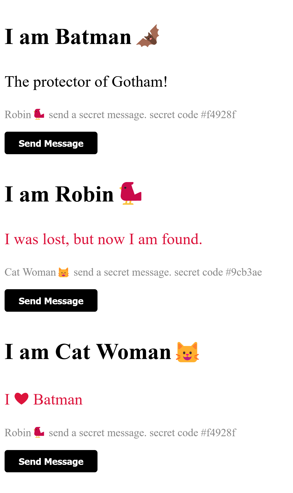

# Example with Inheritance

In this example, we can see that the `HeroSidekick` component not only inherits
most of the functionalities from `Hero` component but also adds its own flavor.

Notice how `Hero` component uses a complex data as `state`.



## template.html

```html
<style></style>

<section>
  <p class="name"></p>
  <p class="tagline"></p>
  <p class="secret"></p>
  <button>Send Message</button>
</section>
```

## styles.css

```css
:host {
  margin: 0;
  padding: 0;
  color: black;
  font-weight: 400;
}

button {
  border: none;
  border-radius: 5px;
  padding: 10px 25px;
  font-size: 1rem;
  font-weight: 600;
  color: #fff;
  background-color: black;
  cursor: pointer;
  transition: all 0.2s ease-in-out;
}

.sidekick-tagline {
  color: crimson;
  font-size: 1.5rem;
}

.name {
  font-size: 2.5rem;
  font-weight: 800;
}

.tagline {
  font-size: 1.75rem;
}

.secret {
  font-size: 1.2rem;
  color: #888888;
}
```

## Hero.ts

```ts
/* eslint-disable no-magic-numbers */
import { deserialize, randomHex, serialize } from '@sohailalam2/abu';
import { ElementalComponent } from '@/elemental-component';

import styles from './styles.css?inline';
import template from './template.html?raw';

interface HeroMessage {
  name: string;
  message: string;
}

export class Hero extends ElementalComponent<HeroMessage> {
  static get observedAttributes() {
    return ['name', 'tagline', 'state'];
  }

  name = '';

  tagline = '';

  protected connectedCallback() {
    super.connectedCallback();

    this.registerEventListeners([
      {
        name: 'click',
        handler: this.onButtonClickHandler,
        attachTo: this.$root.querySelector('button') as HTMLButtonElement,
      },
      {
        name: 'UpdateText',
        handler: this.onUpdateTextHandler,
        isCustomEvent: true,
      },
    ]);

    setTimeout(() => {
      if (!this.name) {
        this.setAttribute('name', 'Cat Woman🐱');
      }
    }, 2000);
  }

  protected render() {
    const style = this.$root.querySelector('style');
    const name = this.$root.querySelector('.name') as HTMLParagraphElement;
    const tagline = this.$root.querySelector('.tagline') as HTMLParagraphElement;
    const secret = this.$root.querySelector('.secret') as HTMLParagraphElement;

    if (style) {
      style.textContent = styles;
    }

    name.textContent = `I am ${this.name}`;
    tagline.textContent = this.tagline;

    if (this.$state) {
      secret.textContent = `
        ${this.$state.name} send a secret message.
        ${this.$state.message}
      `;
    }
  }

  protected onButtonClickHandler(e: Event) {
    e.preventDefault();

    this.raiseEvent(
      'UpdateText',
      true,
      serialize({
        name: this.name,
        message: `secret code #${randomHex()}`,
      }),
    );
  }

  protected onUpdateTextHandler(e: Event): void {
    const msg: HeroMessage = deserialize((e as CustomEvent).detail);

    if (msg.name !== this.name) {
      this.updateState(msg);
    }
  }
}

ElementalComponent.register(Hero, { template });
```

## HeroSidekick.ts

```ts
import { ElementalComponent } from '@/elemental-component';

import { Hero } from './Hero';

export class HeroSidekick extends Hero {
  protected connectedCallback() {
    super.connectedCallback();
    const tagline = this.$root.querySelector('.tagline') as HTMLParagraphElement;

    tagline.classList.add('sidekick-tagline');
  }
}

ElementalComponent.register(HeroSidekick);
```

## index.ts

```ts
import './Hero';
import './HeroSidekick';

// 👌 add the custom element to the document body to render
document.body.innerHTML += `
<el-hero id="one" name="Batman🦇"
                  tagline="The protector of Gotham!">
</el-hero>
<el-hero-sidekick name="Robin🐦"
                  tagline="I was lost, but now I am found.">
</el-hero-sidekick>
<el-hero-sidekick tagline="I ❤ Batman">
</el-hero-sidekick>
`;
```
